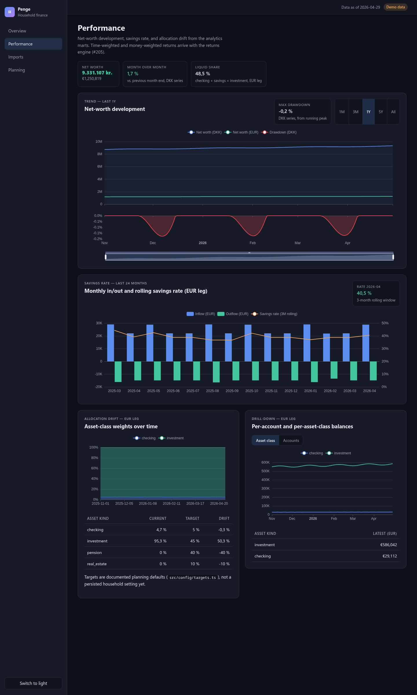

# Modern WebUI

The modern WebUI is a reporting-first React application in `apps/web`.
It is the cockpit for deterministic household reporting, planning workflows,
and explanation-first AI surfaces.

Since the app-shell upgrade (issue #203) it is a real application: routed
surfaces, live data from the FastAPI read API (ADR-0035), ECharts
visualisations, and a dark/light design system. The frontend stack choices
are recorded in ADR-0036.

## Product principles

1. Classical reports are primary.
   Net worth, cashflow, taxes, liquidity, and readiness must come from typed
   data products or simulation outputs.
2. AI explains; it does not invent numbers.
   Assistant answers must reference MCP tool output, assumptions, risks,
   limitations, and source documents.
3. EUR and DKK remain visible as first-class currencies.
   A UI view may focus on one currency, but it must not silently erase the
   other.
4. Demo data is synthetic.
   Never copy real balances, counterparties, statements, or salaries into
   frontend fixtures.

## Surfaces

- **Overview** — net-worth trend (365 days, EUR + DKK), current allocation by
  kind/currency/entity with donut + table, masked account dimension.
- **Performance** — dashboard v2 (#204, #206): KPI header (net worth,
  month-over-month delta, liquid share), range-selectable net-worth trend
  (1M/3M/1Y/5Y/all) with drawdown shading and max-drawdown KPI, TWR index
  lines per account or asset class with optional benchmark overlay
  (normalized price index, native currency — growth-shape comparison only),
  household TWR/MWR summary cards (EUR + DKK legs, with per-leg error notes
  when FX coverage is missing), contribution-vs-growth decomposition,
  recorded-fee drag per year, monthly cashflow with rolling 3-month savings
  rate, asset-class weights over time with drift vs documented target
  weights (`src/config/targets.ts`), and per-account / per-asset-class
  drill-down. Returns methodology lives in the
  [returns engine docs](../analytics/returns.md) (ADR-0039).

  

- **Imports** — guided import wizard (#208) over the staged import-sessions
  API (#207). Three keyboard-accessible steps: upload (drop zone or file
  picker, source auto-detection with manual override, optional entity name),
  review (per-row validation badges for ok/duplicate/error, inline field
  editing with server-side revalidation, exclude/include toggles, commit
  gate while error rows remain), and a commit summary with loader counts.
  A history panel lists past sessions with status and lets staged sessions
  be resumed or discarded. Nothing is written to the warehouse before the
  confirm step; commits reuse the existing connector loaders and are
  idempotent (ADR-0037). In demo mode the whole flow runs against the
  deterministic in-memory store (`src/demo/importsStore.ts`).
  The review step carries the AI layer (#210): "Suggest mappings (AI)"
  proxies the MCP `suggest_import_mapping` tool through
  `POST /imports/{id}/suggestions` (ADR-0038), renders per-row chips
  with field, value, confidence, and reason, and offers per-chip
  accept/reject plus a confidence-threshold bulk accept. Accepted
  values are stored as row `mappings` with `suggested_by`/`accepted_at`
  provenance and an "AI mapped" badge; rejections stay local. When the
  endpoint answers 503 (no `PENGE_MCP_SUGGEST_COMMAND` configured) the
  wizard says so and falls back to manual review.
- **Planning** — labelled synthetic preview of the MCP
  `answer_planning_question` surface until live wiring lands.

## Architecture

- **Routing**: React Router v7 (library mode); all surfaces share the
  `AppShell` layout (sidebar navigation, theme toggle, freshness banner).
- **Data layer**: TanStack Query v5 hooks in `src/api/queries.ts` over a
  typed fetch client (`src/api/client.ts`).
- **Contract**: `pnpm --filter @penge/web generate:api` regenerates
  `src/api/schema.d.ts` from the committed `docs/api/openapi.json`
  (`just web-ui-openapi-client`). zod schemas in `src/api/schemas.ts`
  validate every response at runtime and are type-checked against the
  generated types; CI fails when the generated client drifts.
- **Money**: Decimal values arrive as JSON strings (ADR-0035) and are
  converted to floats only at the display/chart edge (`src/money.ts`).
- **Charts**: tree-shaken Apache ECharts core behind the in-repo `<EChart>`
  wrapper with the SVG renderer.
- **States**: uniform loading, error (with retry and `just api-dev` hint),
  and empty states for every data panel.
- **Demo mode**: `VITE_PENGE_DEMO=true` serves deterministic synthetic
  fixtures (`src/demo/fixtures.ts`) through dynamic import; the production
  path always reads the API. A "Demo data" badge marks the mode.

## AI integration direction

The stable boundary is MCP.
The WebUI can call MCP tools through a backend wrapper, and a future GitHub
Copilot SDK agent can use those same typed tools for multi-step workflows.

Good first AI features:

- explain the current dashboard;
- compare two deterministic scenarios;
- summarize risks and missing assumptions;
- draft a planning memo with evidence links;
- suggest the next stress scenarios to run.

Out of scope for the first WebUI:

- free-form financial advice;
- autonomous assumption changes;
- direct LLM reads of raw statements or raw account data;
- hidden calculations that are not reproduced by deterministic code.

## Local development

End-to-end with live mart data (requires the warehouse from `compose.yaml`):

```bash
just api-dev       # FastAPI read API on 127.0.0.1:8000
just web-ui-dev    # Vite dev server on 127.0.0.1:5173
```

Without a database:

```bash
VITE_PENGE_DEMO=true just web-ui-dev
```

For quality gates:

```bash
just web-ui-build
just web-ui-test
just web-ui-lint
just web-ui-openapi-client   # regenerate the typed API client
```
